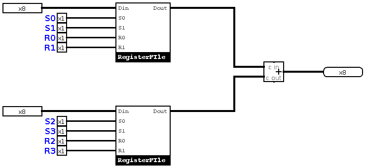

# Chapter 11 : Design, Advanced Addition Machine! 

In [chapter seven](chapter7.md) we designed the must simple (and almost useless) computer, *The Addition Machine*. Now, 
we need to have a background of design and implementation of complex machines, so we add some useful features to our addition 
machine. Our machine had no memory blocks and we couldn't save our inputs and outputs. In this chapter, we will learn how to 
add memory blocks to our addition machine.

## Managing inputs 
Remember our [Register File](chapter9.md)? For now, I want to store my inputs in a register, and then, read from those registers. 
If you look at your simple (or scientific) calculator, you will see a button labled *M* or *M+*. That button is used for inserting 
the inputs or results in calculator's memory. So, I want to make a memory button for our ***Addition Machine***. Our circuit will be 
like this :

This is a good design now, but no! it's not good. One register file is enough for a simple calculator, and we wasted two of them. Also, 
We can't store output in registers. Let's make new devices, which can help us build new things! 

## The Decider