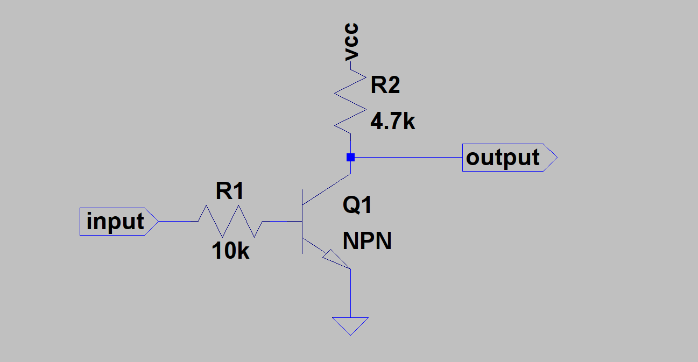

# Chapter 17 : The Dark Side of The Moon
This is not about Pink Floyd's album, this book has nothing to do with music of course. But, I chose this name because 
a lot of *computer engineers* have no idea about design and implementation of the hardware. So, it can be the dark side! 
Some people, including some computer engineers and electrical engineers, joined the dark side and made computers. But this is 
not all! We had computers before transistors. They were usually electro-mechanical or mechanical. But the theory of computation 
is much older than what you think! ***Khawrazmi***, a Persian scientist, is one of the most known people in history of computer 
science. Even the word ***Algorithm*** is taken from his name. In 1947, *Transistor* discovered, and that was the starting point of 
***Electronic Computers***. 

## Digital Electronics
When transistors discovered and manufactured, scientists and engineers found that they can acts like switches. Then, they decided to use 
them as switches. A transistor can act like a switch, but first, look at this square wave: 

It starts at zero volts and ends at five volts. It's like a switch which is connected to a five volts battery, and someone pressed button 
in defined times. This pulse, can be input or output of a transistor. First, let me show you a NOT gate which is made by a ***Bipolar Junction
Transistor*** or in short, **BJT** transistor. BJT transistors are like two diodes connected in a specific arrengement. Usually, we use *NPN* transitors
to make logical circuits:

If we apply a voltage on *input* we will have a ***wave form analysis*** like this : 

As you can see, everytime input is high, output is low, and everytime input is low, output is high. Why? when *input* is high, 
current can move to the ground, but when it's low, current find another way to the ground, which is our output. 

RTL/TTL technologies are good, but later engineers found that ***Field Effect Transistors*** are better. Then, they decide to use 
***Metal Oxyde Semiconductor Field Effect Transistor***s or in short **MOSFET** transistors for their artworks! FETs have different 
structure, but still can act as switch, and even better than BJTs. Also, they can be minimalized better. This is why a lot of digital 
chips around us is made up of MOSFETs. 