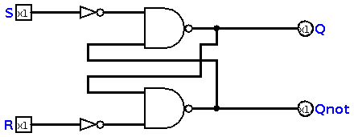
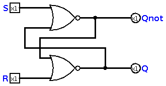

# Chapter 8 : Memory

Although our *Addition Machine* was a complete computer, but actually, a computer without memory is like a car without seats. You know a car can be driven 
without seats, but we add seats, because seats can keep passengers! And this is the point! We want a certain space for keeping data. According to the 
[chapter six](chapter6.md), we know that a *combinational circuit* is a circuit which can solve a logic/arithmetic problem without storing the results. 
In this chapter, we are going to study a new family of circuits, which are called **Sequential Circuits**. 

## Everything is NAND! 
You need NAND, even here. Of course, we need to know how NAND works and how can make memory blocks only using NAND. The simplest memory block is this :

This is called an **active-low S-R flip flop**. If we replace NAND gates with NOR, we will have an **active-high S-R flip flop**. So, as all of the circuits of this book are 
active-high, let's see active-high version of our flip flop :

As you can see, `Q` and `~Q` are replaced in the new circuit. It doesn't matter what kind of flip flop you use, but I actually prefer the active-high one. 
