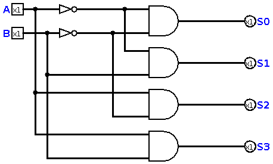

# Chapter 9 : Register File

In previous chapter, we made 1 bit flip flops, and connected them together, then we had registers. Registers are needed, 
but we can't say "We are great computer engineers because we have registers!". Registers have special organization in a computer,
and that's called ___Register File___. In this chapter, we will design a simple one!

## The Decoder
Let's make another combinational circuit here. The circuit we are making here, is called ***Decoder*** . 
Decoders have *n* selectors, and `2^n` outputs. This is why they're decoders! You give them a binary number as
input and you take a hexadecimal number in the output. Of course, you never get the *exact* hex number at the output, 
but you can find hexadecimal notation of input by using a decoder. Let's make one! The simplest decoder we make is a 
2x4 decoder. According to `2^n`, we can also make 1x2 decoder, but it's not actually a real decored. It's an AND gate! 
The logical function of a 2x4 decoder is like this : 
```
S0 = ~A~B  
S1 = ~AB 
S2 = A~B 
S3 = AB 
``` 
So, we can implement our decoder like this : 



But, how we use this in a *Register File* ? 